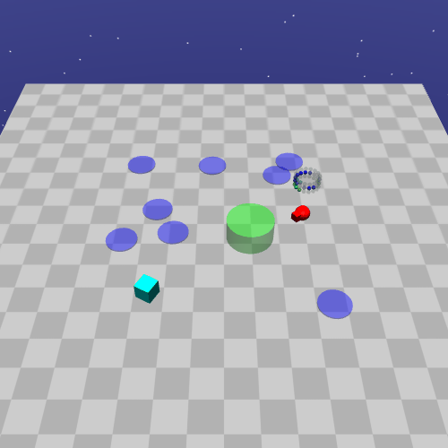
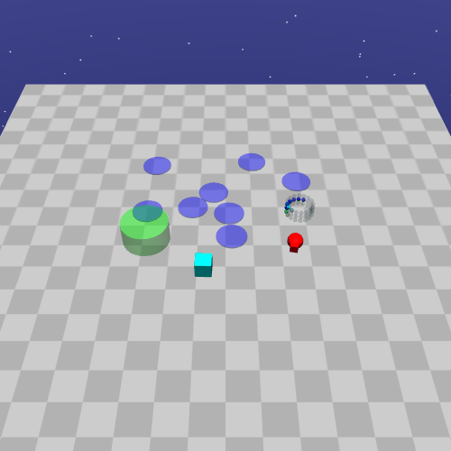
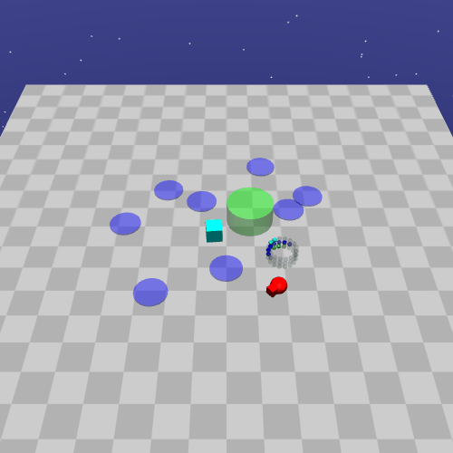
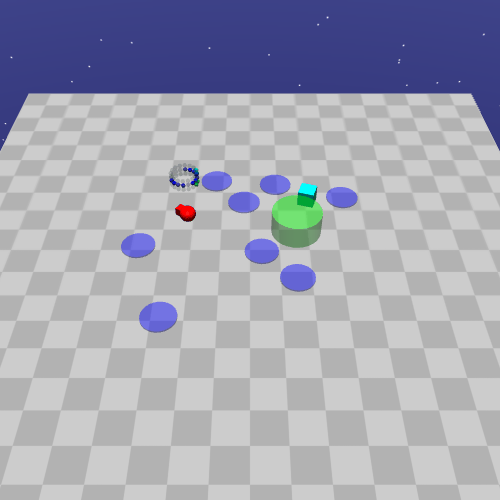
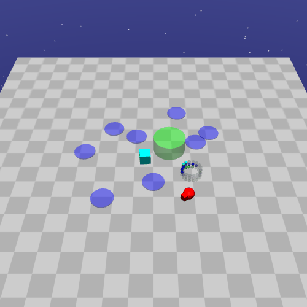
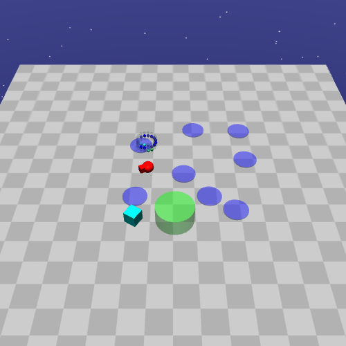
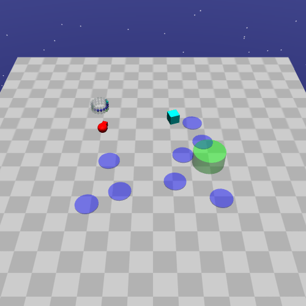
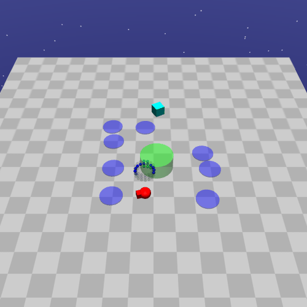
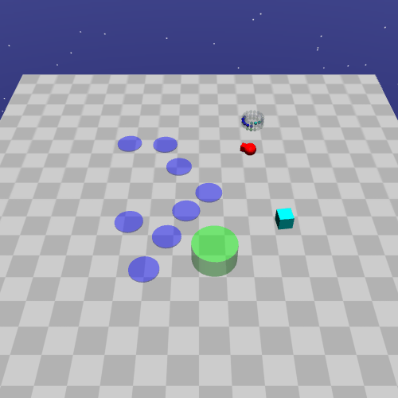

# Intro

This repository contains the code to replicate the experiments of the paper "[An Unreasonably Simple Approach to Safe RL](https://rlj.cs.umass.edu/2026/papers/Paper96.html)". The paper introduces a new framework for safe RL where the agent learns safe policies solely from scalar rewards using any suitable RL algorithm. This is achieved by replacing the rewards at unsafe terminal states by the minmax penalty, which is the strict upperbound reward whose optimal policy minimises the probability of reaching unsafe states.

The code was written as an extension to the [OmniSafe](https://github.com/PKU-Alignment/omnisafe) and [SafetyGymnasium](https://github.com/PKU-Alignment/safety-gymnasium) libraries to add algos and environments.


## Supported RL Algorithms and General Usage

The Value-Range Penalty is compatible with any RL algorithm. Here we have implemented it as a mixin class for OmniSafe algos (see the implementation in `src/rosarl/algorithms`).

# Running the Safety Gymnasium experiments

## Installation
These experiments use environments built from SafetyGymnasium environments and components.

The project uses [uv](https://docs.astral.sh/uv/) to manage dependencies and the virtual environment and can be installed by running the following command from the `rosarl` directory.

```
uv sync
```

**Reproduce Experiments from Paper:** To reproduce an experiment from the paper, run:

```
cd /path/to/rosarl/scripts
source ../.venv/bin/activate
python train_policy_config.py --device DEVICE --config CONFIG --algo ALGO --env-id ENV --seed SEED
```

where 

* `DEVICE` is a PyTorch device description string, e.g., `cuda:0` or `cpu`.
* `CONFIG` is a configuration yaml file. See the `scripts/configs` directory for examples.
* `ALGO` is an algorithm ID taken from the list below.
* `ENV` is taken from the table below .
* `SEED` is an integer. In the paper experiments, we used seeds of 0-10, but results may not reproduce perfectly deterministically across machines.

* Algoritms: PPO-ValueRange (ID: PPOMinmax), TRPO-ValueRange (ID: TRPOMinmax), PPO, TRPO, TRPOLag, TRPOSaute, P3O, CPPOPID
* Environments: SafetyterminalgoalPointGoal1-v0, SafetyterminalgoalPointPush1-v0, SafetyterminalgoalPointPillar{0,1,2,3,4,5,6,7,8}-v0, SafetyterminalHumanoidVelocity-v1

Several metrics are recorded for later evaluation:


<table>
  <tr>
    <th rowspan="2" scope="rowgroup">TRPO</th>
    <td style="text-align:center"> Success </td>
    <td> </td>
    <td></td>
    <td></td>
    <td></td>
   </tr> 
   <tr>
    <td style="text-align:center"> Failure </td>
    <td> </td>
    <td></td>
    <td></td>
    <td></td>
  </tr>
  <tr>
    <th rowspan="2" scope="rowgroup">TRPO Lagrangian</th>
    <td style="text-align:center"> Success </td>
    <td> </td>
    <td></td>
    <td></td>
    <td></td>
   </tr> 
   <tr>
    <td style="text-align:center"> Failure </td>
    <td> </td>
    <td></td>
    <td></td>
    <td></td>
  </tr>
  <tr>
    <th rowspan="2" scope="rowgroup">CPO</th>
    <td style="text-align:center"> Success </td>
    <td> </td>
    <td></td>
    <td></td>
    <td></td>
   </tr> 
   <tr>
    <td style="text-align:center"> Failure </td>
    <td> </td>
    <td></td>
    <td></td>
    <td></td>
  </tr>
  <tr>
    <th rowspan="2" scope="rowgroup">TRPO Value-Range (Ours)</th>
    <td style="text-align:center"> Success </td>
    <td> </td>
    <td></td>
    <td></td>
    <td></td>
   </tr> 
   <tr>
    <td style="text-align:center"> Failure </td>
    <td> </td>
    <td></td>
    <td></td>
    <td></td>
  </tr>
</table>


## Cite the Paper

```
@article{NangueTasse2026,
    author = {Nangue Tasse, Geraud and Nemecek, Mark and Love, Tamlin and James, Steven and Rosman, Benjamin},
    title = {{An Unreasonably Simple Approach to Safe RL}},
    journal = {{Reinforcement Learning Journal, vol. 7}},
    year = {2026}
}
```
